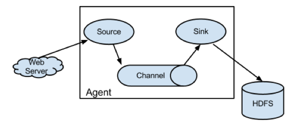
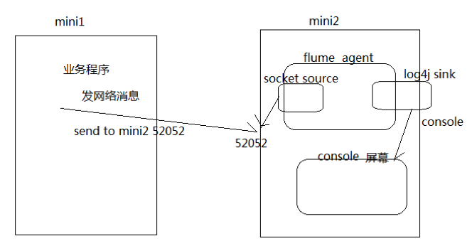

# Day 06 Flume

## 1. Flume 介绍

### 1.1. 概述

* Flume是一个分布式、可靠、和高可用的海量日志采集、聚合和传输的系统。
* Flume可以采集文件，socket数据包、文件、文件夹、kafka等各种形式源数据，又可以将采集到的数据(下沉sink)输出到HDFS、hbase、hive、kafka等众多外部存储系统中
* 一般的采集需求，通过对flume的简单配置即可实现
* Flume针对特殊场景也具备良好的自定义扩展能力，
因此，flume可以适用于大部分的日常数据采集场景

### 1.2. 运行机制

1. Flume分布式系统中最核心的角色是agent，flume采集系统就是由一个个agent所连接起来形成
2. 每一个agent相当于一个数据传递员，内部有三个组件：
    1. Source：采集组件，用于跟数据源对接，以获取数据
    2. Sink：下沉组件，用于往下一级agent传递数据或者往最终存储系统传递数据
    3. Channel：传输通道组件，用于从source将数据传递到sink

       	

### 1.3. Flume 结构图

##### 简单结构

单个 Agent 采集数据

	

##### 复杂结构

多级 Agent 之间串联

	

## 2. Flume 实战案例

> 案例：使用网络telent命令向一台机器发送一些网络数据，然后通过flume采集网络端口数据

> 

### 2.1. Flume 的安装部署

##### Step 1: 下载解压修改配置文件

下载地址：

http://archive.apache.org/dist/flume/1.8.0/apache-flume-1.8.0-bin.tar.gz

Flume的安装非常简单，只需要解压即可，当然，前提是已有hadoop环境

上传安装包到数据源所在节点上

这里我们采用在第三台机器来进行安装

```shell
cd /export/softwares/
tar -zxvf apache-flume-1.8.0-bin.tar.gz -C ../servers/
cd /export/servers/apache-flume-1.8.0-bin/conf
cp  flume-env.sh.template flume-env.sh
vim flume-env.sh
export JAVA_HOME=/export/servers/jdk1.8.0_141
```

##### Step 2: 开发配置文件

根据数据采集的需求配置采集方案，描述在配置文件中(文件名可任意自定义)

配置我们的网络收集的配置文件
在flume的conf目录下新建一个配置文件（采集方案）

```shell
vim   /export/servers/apache-flume-1.8.0-bin/conf/netcat-logger.conf
```

```properties
# 定义这个agent中各组件的名字
a1.sources = r1
a1.sinks = k1
a1.channels = c1

# 描述和配置source组件：r1
a1.sources.r1.type = netcat
a1.sources.r1.bind = 192.168.174.
a1.sources.r1.port = 44444

# 描述和配置sink组件：k1
a1.sinks.k1.type = logger

# 描述和配置channel组件，此处使用是内存缓存的方式
a1.channels.c1.type = memory
a1.channels.c1.capacity = 1000
a1.channels.c1.transactionCapacity = 100

# 描述和配置source  channel   sink之间的连接关系
a1.sources.r1.channels = c1
a1.sinks.k1.channel = c1
```

##### Step 3: 启动配置文件

指定采集方案配置文件，在相应的节点上启动flume agent

先用一个最简单的例子来测试一下程序环境是否正常
启动agent去采集数据

```shell
bin/flume-ng agent -c conf -f conf/netcat-logger.conf -n a1  -Dflume.root.logger=INFO,console
```

* `-c conf`   指定flume自身的配置文件所在目录
* `-f conf/netcat-logger.con`  指定我们所描述的采集方案
* `-n a1`  指定我们这个agent的名字

##### Step 4: 安装 Telnet 准备测试

在node02机器上面安装telnet客户端，用于模拟数据的发送

```shell
yum -y install telnet
telnet  node03  44444   # 使用telnet模拟数据发送
```

### 2.2. 采集案例

#### 2.2.3. 采集目录到 HDFS


##### 需求

某服务器的某特定目录下，会不断产生新的文件，每当有新文件出现，就需要把文件采集到HDFS中去

##### 思路

根据需求，首先定义以下3大要素
1. 数据源组件，即source ——监控文件目录 :  spooldir
    1. 监视一个目录，只要目录中出现新文件，就会采集文件中的内容
    2. 采集完成的文件，会被agent自动添加一个后缀：COMPLETED
    3. 所监视的目录中不允许重复出现相同文件名的文件
2. 下沉组件，即sink——HDFS文件系统  :  hdfs sink
3. 通道组件，即channel——可用file channel 也可以用内存channel

##### Step 1: Flume 配置文件

```shell
cd  /export/servers/apache-flume-1.8.0-bin/conf
mkdir -p /export/servers/dirfile
vim spooldir.conf
```

```properties
# Name the components on this agent
a1.sources = r1
a1.sinks = k1
a1.channels = c1
# Describe/configure the source
##注意：不能往监控目中重复丢同名文件
a1.sources.r1.type = spooldir
a1.sources.r1.spoolDir = /export/servers/dirfile
a1.sources.r1.fileHeader = true
# Describe the sink
a1.sinks.k1.type = hdfs
a1.sinks.k1.channel = c1
a1.sinks.k1.hdfs.path = hdfs://node01:8020/spooldir/files/%y-%m-%d/%H%M/
a1.sinks.k1.hdfs.filePrefix = events-
a1.sinks.k1.hdfs.round = true
a1.sinks.k1.hdfs.roundValue = 10
a1.sinks.k1.hdfs.roundUnit = minute
a1.sinks.k1.hdfs.rollInterval = 3

a1.sinks.k1.hdfs.rollSize = 20
a1.sinks.k1.hdfs.rollCount = 5
a1.sinks.k1.hdfs.batchSize = 1
a1.sinks.k1.hdfs.useLocalTimeStamp = true

#生成的文件类型，默认是Sequencefile，可用DataStream，则为普通文本

a1.sinks.k1.hdfs.fileType = DataStream

# Use a channel which buffers events in memory
a1.channels.c1.type = memory
a1.channels.c1.capacity = 1000
a1.channels.c1.transactionCapacity = 100
# Bind the source and sink to the channel
a1.sources.r1.channels = c1
a1.sinks.k1.channel = c1
```

Channel参数解释

capacity：默认该通道中最大的可以存储的event数量
trasactionCapacity：每次最大可以从source中拿到或者送到sink中的event数量
keep-alive：event添加到通道中或者移出的允许时间

##### Step 2: 启动 Flume

```shell
bin/flume-ng agent -c ./conf -f ./conf/spooldir.conf -n a1 -Dflume.root.logger=INFO,console
```

##### Step 3: 上传文件到指定目录

将不同的文件放到下面目录里面去，注意文件不能重名

```shell
cd /export/servers/dirfile
```


#### 2.2.4. 采集文件到 HDFS

##### 需求

比如业务系统使用log4j生成的日志，日志内容不断增加，需要把追加到日志文件中的数据实时采集到hdfs

##### 分析

根据需求，首先定义以下3大要素
* 采集源，即source——监控文件内容更新 :  exec  ‘tail -F 	file’
* 下沉目标，即sink——HDFS文件系统  :  hdfs sink
* Source和sink之间的传递通道——channel，可用file channel 也可以用 内存channel

##### Step 1: 定义 Flume 配置文件

```shell
cd /export/servers/apache-flume-1.8.0-bin/conf
vim tail-file.conf
```

```properties
agent1.sources = source1
agent1.sinks = sink1
agent1.channels = channel1

# Describe/configure tail -F source1
agent1.sources.source1.type = exec
agent1.sources.source1.command = tail -F /export/servers/taillogs/access_log
agent1.sources.source1.channels = channel1


# Describe sink1
agent1.sinks.sink1.type = hdfs
#a1.sinks.k1.channel = c1
agent1.sinks.sink1.hdfs.path = hdfs://node01:8020/weblog/flume-collection/%y-%m-%d/%H-%M
agent1.sinks.sink1.hdfs.filePrefix = access_log
agent1.sinks.sink1.hdfs.maxOpenFiles = 5000
agent1.sinks.sink1.hdfs.batchSize= 100
agent1.sinks.sink1.hdfs.fileType = DataStream
agent1.sinks.sink1.hdfs.writeFormat =Text
 
agent1.sinks.sink1.hdfs.round = true
agent1.sinks.sink1.hdfs.roundValue = 10
agent1.sinks.sink1.hdfs.roundUnit = minute
agent1.sinks.sink1.hdfs.useLocalTimeStamp = true

# Use a channel which buffers events in memory
agent1.channels.channel1.type = memory
agent1.channels.channel1.keep-alive = 120
agent1.channels.channel1.capacity = 500000
agent1.channels.channel1.transactionCapacity = 600

# Bind the source and sink to the channel
agent1.sources.source1.channels = channel1
agent1.sinks.sink1.channel = channel1
```

##### Step 2: 启动 Flume

```shell
cd  /export/servers/apache-flume-1.8.0-bin
bin/flume-ng agent -c conf -f conf/tail-file.conf -n agent1  -Dflume.root.logger=INFO,console
```

##### Step 3: 开发 Shell 脚本定时追加文件内容

```shell
mkdir -p /export/servers/shells/
cd  /export/servers/shells/
vim tail-file.sh
```

```shell
#!/bin/bash
while true
do
 date >> /export/servers/taillogs/access_log;
  sleep 0.5;
done
```

##### Step 4: 启动脚本

```shell
# 创建文件夹
mkdir -p /export/servers/taillogs
# 启动脚本
sh /export/servers/shells/tail-file.sh
```

#### 2.2.5. Agent 级联


##### 分析

第一个agent负责收集文件当中的数据，通过网络发送到第二个agent当中去
第二个agent负责接收第一个agent发送的数据，并将数据保存到hdfs上面去

##### Step 1: Node02 安装 Flume

将node03机器上面解压后的flume文件夹拷贝到node02机器上面去
```shell
cd  /export/servers
scp -r apache-flume-1.8.0-bin/ node02:$PWD
```

##### Step 2: Node02 配置 Flume

在node02机器配置我们的flume
```shell
cd /export/servers/ apache-flume-1.8.0-bin/conf
vim tail-avro-avro-logger.conf
```

```properties
##################
# Name the components on this agent
a1.sources = r1
a1.sinks = k1
a1.channels = c1
# Describe/configure the source
a1.sources.r1.type = exec
a1.sources.r1.command = tail -F /export/servers/taillogs/access_log
a1.sources.r1.channels = c1
# Describe the sink
##sink端的avro是一个数据发送者
a1.sinks = k1
a1.sinks.k1.type = avro
a1.sinks.k1.channel = c1
a1.sinks.k1.hostname = node03
a1.sinks.k1.port = 4141
a1.sinks.k1.batch-size = 10
# Use a channel which buffers events in memory
a1.channels.c1.type = memory
a1.channels.c1.capacity = 1000
a1.channels.c1.transactionCapacity = 100
# Bind the source and sink to the channel
a1.sources.r1.channels = c1
a1.sinks.k1.channel = c1
```

##### Step 3: 开发脚本向文件中写入数据

直接将node03下面的脚本和数据拷贝到node02即可，node03机器上执行以下命令

```shell
cd  /export/servers
scp -r shells/ taillogs/ node02:$PWD
```

##### Step 4: Node03 Flume 配置文件

在node03机器上开发flume的配置文件

```shell
cd /export/servers/apache-flume-1.8.0-bin/conf
vim avro-hdfs.conf
```

```properties
# Name the components on this agent
a1.sources = r1
a1.sinks = k1
a1.channels = c1
# Describe/configure the source
##source中的avro组件是一个接收者服务
a1.sources.r1.type = avro
a1.sources.r1.channels = c1
a1.sources.r1.bind = node03
a1.sources.r1.port = 4141
# Describe the sink
a1.sinks.k1.type = hdfs
a1.sinks.k1.hdfs.path = hdfs://node01:8020/av/%y-%m-%d/%H%M/
a1.sinks.k1.hdfs.filePrefix = events-
a1.sinks.k1.hdfs.round = true
a1.sinks.k1.hdfs.roundValue = 10
a1.sinks.k1.hdfs.roundUnit = minute
a1.sinks.k1.hdfs.rollInterval = 3
a1.sinks.k1.hdfs.rollSize = 20
a1.sinks.k1.hdfs.rollCount = 5
a1.sinks.k1.hdfs.batchSize = 1
a1.sinks.k1.hdfs.useLocalTimeStamp = true
#生成的文件类型，默认是Sequencefile，可用DataStream，则为普通文本
a1.sinks.k1.hdfs.fileType = DataStream
# Use a channel which buffers events in memory
a1.channels.c1.type = memory
a1.channels.c1.capacity = 1000
a1.channels.c1.transactionCapacity = 100

# Bind the source and sink to the channel
a1.sources.r1.channels = c1
a1.sinks.k1.channel = c1
```

##### Step 5: 顺序启动

node03机器启动flume进程

```shell
cd /export/servers/apache-flume-1.8.0-bin
bin/flume-ng agent -c conf -f conf/avro-hdfs.conf -n a1  -Dflume.root.logger=INFO,console
```

node02机器启动flume进程
```shell
cd /export/servers/apache-flume-1.8.0-bin/
bin/flume-ng agent -c conf -f conf/tail-avro-avro-logger.conf -n a1  -Dflume.root.logger=INFO,console
```

node02机器启shell脚本生成文件
```shell
cd  /export/servers/shells
sh tail-file.sh
```

## 3. flume的高可用方案-failover

在完成单点的Flume NG搭建后，下面我们搭建一个高可用的Flume NG集群，架构图如下所示：

### 3.1. 角色分配

Flume的Agent和Collector分布如下表所示：
| 名称　| 	HOST	| 角色 |
| --- | --- | --- |
| Agent1	| node01	| Web Server|
| Collector1	| node02	| AgentMstr1|
| Collector2	| node03	| AgentMstr2|

图中所示，Agent1数据分别流入到Collector1和Collector2，Flume NG本身提供了Failover机制，可以自动切换和恢复。在上图中，有3个产生日志服务器分布在不同的机房，要把所有的日志都收集到一个集群中存储。下 面我们开发配置Flume NG集群


### 3.2. Node01 安装和配置

将node03机器上面的flume安装包以及文件生产的两个目录拷贝到node01机器上面去

node03机器执行以下命令

```shell
cd /export/servers
scp -r apache-flume-1.8.0-bin/ node01:$PWD
scp -r shells/ taillogs/ node01:$PWD
```

node01机器配置agent的配置文件

```shell
cd /export/servers/apache-flume-1.8.0-bin/conf
vim agent.conf
```

```properties
#agent1 name
agent1.channels = c1
agent1.sources = r1
agent1.sinks = k1 k2
#
##set gruop
agent1.sinkgroups = g1
#

agent1.sources.r1.channels = c1
agent1.sources.r1.type = exec
agent1.sources.r1.command = tail -F /export/servers/taillogs/access_log
#
##set channel
agent1.channels.c1.type = memory
agent1.channels.c1.capacity = 1000
agent1.channels.c1.transactionCapacity = 100
#
## set sink1
agent1.sinks.k1.channel = c1
agent1.sinks.k1.type = avro
agent1.sinks.k1.hostname = node02
agent1.sinks.k1.port = 52020
#
## set sink2
agent1.sinks.k2.channel = c1
agent1.sinks.k2.type = avro
agent1.sinks.k2.hostname = node03
agent1.sinks.k2.port = 52020
#
##set sink group
agent1.sinkgroups.g1.sinks = k1 k2
#
##set failover
agent1.sinkgroups.g1.processor.type = failover
agent1.sinkgroups.g1.processor.priority.k1 = 10
agent1.sinkgroups.g1.processor.priority.k2 = 1
agent1.sinkgroups.g1.processor.maxpenalty = 10000
```

### 3.3. Node02 与 Node03 配置 FlumeCollection

node02机器修改配置文件

```shell
cd /export/servers/apache-flume-1.8.0-bin/conf
vim collector.conf
```

```properties
#set Agent name
a1.sources = r1
a1.channels = c1
a1.sinks = k1
#
##set channel
a1.channels.c1.type = memory
a1.channels.c1.capacity = 1000
a1.channels.c1.transactionCapacity = 100
#
## other node,nna to nns
a1.sources.r1.type = avro
a1.sources.r1.bind = node02
a1.sources.r1.port = 52020
a1.sources.r1.channels = c1
#
##set sink to hdfs
a1.sinks.k1.type=hdfs
a1.sinks.k1.hdfs.path= hdfs://node01:8020/flume/failover/
a1.sinks.k1.hdfs.fileType=DataStream
a1.sinks.k1.hdfs.writeFormat=TEXT
a1.sinks.k1.hdfs.rollInterval=10
a1.sinks.k1.channel=c1
a1.sinks.k1.hdfs.filePrefix=%Y-%m-%d
#
```

node03机器修改配置文件

```shell
cd  /export/servers/apache-flume-1.8.0-bin/conf
vim collector.conf
```

```properties
#set Agent name
a1.sources = r1
a1.channels = c1
a1.sinks = k1
#
##set channel
a1.channels.c1.type = memory
a1.channels.c1.capacity = 1000
a1.channels.c1.transactionCapacity = 100
#
## other node,nna to nns
a1.sources.r1.type = avro
a1.sources.r1.bind = node03
a1.sources.r1.port = 52020
a1.sources.r1.channels = c1
#
##set sink to hdfs
a1.sinks.k1.type=hdfs
a1.sinks.k1.hdfs.path= hdfs://node01:8020/flume/failover/
a1.sinks.k1.hdfs.fileType=DataStream
a1.sinks.k1.hdfs.writeFormat=TEXT
a1.sinks.k1.hdfs.rollInterval=10
a1.sinks.k1.channel=c1
a1.sinks.k1.hdfs.filePrefix=%Y-%m-%d
```

### 3.4. 顺序启动

node03机器上面启动flume

```shell
cd /export/servers/apache-flume-1.8.0-bin
bin/flume-ng agent -n a1 -c conf -f conf/collector.conf -Dflume.root.logger=DEBUG,console
```

node02机器上面启动flume

```shell
cd /export/servers/apache-flume-1.8.0-bin
bin/flume-ng agent -n a1 -c conf -f conf/collector.conf -Dflume.root.logger=DEBUG,console
```

node01机器上面启动flume

```shell
cd /export/servers/apache-flume-1.8.0-bin
bin/flume-ng agent -n agent1 -c conf -f conf/agent.conf -Dflume.root.logger=DEBUG,console
```

node01机器启动文件产生脚本

```shell
cd  /export/servers/shells
sh tail-file.sh
```

### 3.5. Failover 测试

下面我们来测试下Flume NG集群的高可用（故障转移）。场景如下：我们在Agent1节点上传文件，由于我们配置Collector1的权重比Collector2大，所以 Collector1优先采集并上传到存储系统。然后我们kill掉Collector1，此时有Collector2负责日志的采集上传工作，之后，我 们手动恢复Collector1节点的Flume服务，再次在Agent1上次文件，发现Collector1恢复优先级别的采集工作。具体截图如下所 示：

Collector1优先上传

	

HDFS集群中上传的log内容预览

	

Collector1宕机，Collector2获取优先上传权限

	

重启Collector1服务，Collector1重新获得优先上传的权限

## 4. flume 的负载均衡

负载均衡是用于解决一台机器(一个进程)无法解决所有请求而产生的一种算法。Load balancing Sink Processor 能够实现 load balance 功能，如下图Agent1 是一个路由节点，负责将 Channel 暂存的 Event 均衡到对应的多个 Sink组件上，而每个 Sink 组件分别连接到一个独立的 Agent 上，示例配置，如下所示：

 

 

在此处我们通过三台机器来进行模拟flume的负载均衡

三台机器规划如下：

node01：采集数据，发送到node02和node03机器上去

node02：接收node01的部分数据

node03：接收node01的部分数据

 

### 第一步：开发node01服务器的flume配置

node01服务器配置：

~~~shell
cd /export/servers/apache-flume-1.8.0-bin/conf
vim load_banlancer_client.conf
~~~

~~~shell
#agent name

a1.channels = c1
a1.sources = r1
a1.sinks = k1 k2

 

#set gruop

a1.sinkgroups = g1

#set channel

a1.channels.c1.type = memory
a1.channels.c1.capacity = 1000
a1.channels.c1.transactionCapacity = 100
a1.sources.r1.channels = c1
a1.sources.r1.type = exec
a1.sources.r1.command = tail -F /export/servers/taillogs/access_log

# set sink1

a1.sinks.k1.channel = c1
a1.sinks.k1.type = avro
a1.sinks.k1.hostname = node02
a1.sinks.k1.port = 52020

# set sink2
a1.sinks.k2.channel = c1
a1.sinks.k2.type = avro
a1.sinks.k2.hostname = node03
a1.sinks.k2.port = 52020
#set sink group

a1.sinkgroups.g1.sinks = k1 k2

#set failover

a1.sinkgroups.g1.processor.type = load_balance
a1.sinkgroups.g1.processor.backoff = true
a1.sinkgroups.g1.processor.selector = round_robin
a1.sinkgroups.g1.processor.selector.maxTimeOut=10000

~~~

### 第二步：开发node02服务器的flume配置

~~~shell
cd /export/servers/apache-flume-1.8.0-bin/conf

vim load_banlancer_server.conf
~~~

~~~shell
# Name the components on this agent

a1.sources = r1
a1.sinks = k1
a1.channels = c1

# Describe/configure the source

a1.sources.r1.type = avro
a1.sources.r1.channels = c1
a1.sources.r1.bind = node02
a1.sources.r1.port = 52020

# Describe the sink
a1.sinks.k1.type = logger

# Use a channel which buffers events in memory
a1.channels.c1.type = memory
a1.channels.c1.capacity = 1000
a1.channels.c1.transactionCapacity = 100

# Bind the source and sink to the channel
a1.sources.r1.channels = c1
a1.sinks.k1.channel = c1

~~~

### 第三步：开发node03服务器flume配置

node03服务器配置

~~~shell
cd /export/servers/apache-flume-1.8.0-bin/conf
vim load_banlancer_server.conf
~~~

~~~shell
# Name the components on this agent
a1.sources = r1
a1.sinks = k1
a1.channels = c1

# Describe/configure the source
a1.sources.r1.type = avro
a1.sources.r1.channels = c1
a1.sources.r1.bind = node03
a1.sources.r1.port = 52020

# Describe the sink
a1.sinks.k1.type = logger
 
# Use a channel which buffers events in memory
a1.channels.c1.type = memory
a1.channels.c1.capacity = 1000
a1.channels.c1.transactionCapacity = 100

 
# Bind the source and sink to the channel
a1.sources.r1.channels = c1
a1.sinks.k1.channel = c1
~~~

### 第四步：准备启动flume服务

启动node03的flume服务

~~~shell
cd /export/servers/apache-flume-1.8.0-bin
bin/flume-ng agent -n a1 -c conf -f conf/load_banlancer_server.conf -Dflume.root.logger=DEBUG,console
~~~

启动node02的flume服务

~~~shell
cd /export/servers/apache-flume-1.8.0-bin
bin/flume-ng agent -n a1 -c conf -f conf/load_banlancer_server.conf -Dflume.root.logger=DEBUG,console
~~~

启动node01的flume服务

~~~shell
cd /export/servers/apache-flume-1.8.0-bin

bin/flume-ng agent -n a1 -c conf -f conf/load_banlancer_client.conf -Dflume.root.logger=DEBUG,console
~~~

### 第五步：node01服务器运行脚本产生数据

cd /export/servers/shells

sh tail-file.sh

 

## 5. Flume 案例-静态拦截器

### **1.** **案例场景**

A、B两台日志服务机器实时生产日志主要类型为access.log、nginx.log、web.log 

现在要求： 

把A、B 机器中的access.log、nginx.log、web.log 采集汇总到C机器上然后统一收集到hdfs中。

但是在hdfs中要求的目录为：

~~~shell
/source/logs/access/20180101/**
/source/logs/nginx/20180101/**
/source/logs/web/20180101/**
~~~

### **2.** **场景分析**

 

 

​                          图一

### **3.** **数据流程处理分析**

 

### 4、实现

服务器A对应的IP为 192.168.174.100

服务器B对应的IP为 192.168.174.110

服务器C对应的IP为 node03

#### **采集**端配置文件开发

node01与node02服务器开发flume的配置文件

~~~shell
cd /export/servers/apache-flume-1.8.0-bin/conf
vim exec_source_avro_sink.conf
~~~

~~~shell
# Name the components on this agent
a1.sources = r1 r2 r3
a1.sinks = k1
a1.channels = c1
# Describe/configure the source
a1.sources.r1.type = exec
a1.sources.r1.command = tail -F /export/servers/taillogs/access.log
a1.sources.r1.interceptors = i1
a1.sources.r1.interceptors.i1.type = static
##  static拦截器的功能就是往采集到的数据的header中插入自己定## 义的key-value对
a1.sources.r1.interceptors.i1.key = type
a1.sources.r1.interceptors.i1.value = access

a1.sources.r2.type = exec
a1.sources.r2.command = tail -F /export/servers/taillogs/nginx.log
a1.sources.r2.interceptors = i2
a1.sources.r2.interceptors.i2.type = static
a1.sources.r2.interceptors.i2.key = type
a1.sources.r2.interceptors.i2.value = nginx

a1.sources.r3.type = exec
a1.sources.r3.command = tail -F /export/servers/taillogs/web.log
a1.sources.r3.interceptors = i3
a1.sources.r3.interceptors.i3.type = static
a1.sources.r3.interceptors.i3.key = type
a1.sources.r3.interceptors.i3.value = web

# Describe the sink
a1.sinks.k1.type = avro
a1.sinks.k1.hostname = node03
a1.sinks.k1.port = 41414
# Use a channel which buffers events in memory
a1.channels.c1.type = memory
a1.channels.c1.capacity = 20000
a1.channels.c1.transactionCapacity = 10000
 
# Bind the source and sink to the channel
a1.sources.r1.channels = c1
a1.sources.r2.channels = c1
a1.sources.r3.channels = c1
a1.sinks.k1.channel = c1

~~~

 

#### 服务端配置文件开发

在node03上面开发flume配置文件

~~~shell
cd /export/servers/apache-flume-1.8.0-bin/conf
vim avro_source_hdfs_sink.conf
~~~

~~~shell
a1.sources = r1
a1.sinks = k1
a1.channels = c1
#定义source
a1.sources.r1.type = avro
a1.sources.r1.bind = node03
a1.sources.r1.port =41414

#添加时间拦截器
a1.sources.r1.interceptors = i1
a1.sources.r1.interceptors.i1.type = org.apache.flume.interceptor.TimestampInterceptor$Builder
#定义channels
a1.channels.c1.type = memory
a1.channels.c1.capacity = 20000
a1.channels.c1.transactionCapacity = 10000
#定义sink
a1.sinks.k1.type = hdfs
a1.sinks.k1.hdfs.path=hdfs://node01:8020/source/logs/%{type}/%Y%m%d
a1.sinks.k1.hdfs.filePrefix =events
a1.sinks.k1.hdfs.fileType = DataStream
a1.sinks.k1.hdfs.writeFormat = Text
#时间类型
a1.sinks.k1.hdfs.useLocalTimeStamp = true
#生成的文件不按条数生成
a1.sinks.k1.hdfs.rollCount = 0
#生成的文件按时间生成
a1.sinks.k1.hdfs.rollInterval = 30
#生成的文件按大小生成
a1.sinks.k1.hdfs.rollSize  = 10485760
#批量写入hdfs的个数
a1.sinks.k1.hdfs.batchSize = 10000
#flume操作hdfs的线程数（包括新建，写入等）
a1.sinks.k1.hdfs.threadsPoolSize=10
#操作hdfs超时时间
a1.sinks.k1.hdfs.callTimeout=30000
#组装source、channel、sink
a1.sources.r1.channels = c1
a1.sinks.k1.channel = c1
~~~

 

#### **采集端文件**生成脚本

在node01与node02上面开发shell脚本，模拟数据生成

~~~shell
cd /export/servers/shells
vim server.sh 
~~~

~~~shell
#!/bin/bash

while true

do  

 date >> /export/servers/taillogs/access.log; 

 date >> /export/servers/taillogs/web.log;

 date >> /export/servers/taillogs/nginx.log;

  sleep 0.5;

done

~~~

#### **顺序**启动服务

node03启动flume实现数据收集

~~~shell
cd /export/servers/apache-flume-1.8.0-bin

bin/flume-ng agent -c conf -f conf/avro_source_hdfs_sink.conf -name a1 -Dflume.root.logger=DEBUG,console
~~~

node01与node02启动flume实现数据监控

~~~shell
cd /export/servers/apache-flume-1.8.0-bin

bin/flume-ng agent -c conf -f conf/exec_source_avro_sink.conf -name a1 -Dflume.root.logger=DEBUG,console
~~~

node01与node02启动生成文件脚本

~~~shell
cd /export/servers/shells
sh server.sh
~~~

 

### **5**、项目实现截图

 

 

 

 


## 6. Flume 案例二

### **案例**需求：

在数据采集之后，通过flume的拦截器，实现不需要的数据过滤掉，并将指定的第一个字段进行加密，加密之后再往hdfs上面保存

### **原始**数据与处理之后的数据对比

 

图一  原始文件内容

 

图二  HDFS上产生收集到的处理数

### **实现**步骤

#### **第一步**：创建maven java工程，导入jar包

~~~xml
<?xml version="1.0" encoding="UTF-8"?>
<project xmlns="http://maven.apache.org/POM/4.0.0"
         xmlns:xsi="http://www.w3.org/2001/XMLSchema-instance"
         xsi:schemaLocation="http://maven.apache.org/POM/4.0.0 http://maven.apache.org/xsd/maven-4.0.0.xsd">
    <modelVersion>4.0.0</modelVersion>

    <groupId>cn.itcast.cloud</groupId>
    <artifactId>example-flume-intercepter</artifactId>
    <version>1.0-SNAPSHOT</version>

    <dependencies>
        <dependency>
            <groupId>org.apache.flume</groupId>
            <artifactId>flume-ng-sdk</artifactId>
            <version>1.8.0</version>
        </dependency>
        <dependency>
            <groupId>org.apache.flume</groupId>
            <artifactId>flume-ng-core</artifactId>
            <version>1.8.0</version>
        </dependency>
    </dependencies>

    <build>
        <plugins>
            <plugin>
                <groupId>org.apache.maven.plugins</groupId>
                <artifactId>maven-compiler-plugin</artifactId>
                <version>3.0</version>
                <configuration>
                    <source>1.8</source>
                    <target>1.8</target>
                    <encoding>UTF-8</encoding>
                    <!--    <verbal>true</verbal>-->
                </configuration>
            </plugin>
            <plugin>
                <groupId>org.apache.maven.plugins</groupId>
                <artifactId>maven-shade-plugin</artifactId>
                <version>3.1.1</version>
                <executions>
                    <execution>
                        <phase>package</phase>
                        <goals>
                            <goal>shade</goal>
                        </goals>
                        <configuration>
                            <filters>
                                <filter>
                                    <artifact>*:*</artifact>
                                    <excludes>
                                        <exclude>META-INF/*.SF</exclude>
                                        <exclude>META-INF/*.DSA</exclude>
                                        <exclude>META-INF/*.RSA</exclude>
                                    </excludes>
                                </filter>
                            </filters>
                            <transformers>
                                <transformer implementation="org.apache.maven.plugins.shade.resource.ManifestResourceTransformer">
                                    <mainClass></mainClass>
                                </transformer>
                            </transformers>
                        </configuration>
                    </execution>
                </executions>
            </plugin>
        </plugins>
    </build>
</project>
~~~


#### **第二步**：自定义flume的拦截器

~~~java
package cn.itcast.iterceptor;
import com.google.common.base.Charsets;
import org.apache.flume.Context;
import org.apache.flume.Event;
import org.apache.flume.interceptor.Interceptor;
import java.security.MessageDigest;
import java.security.NoSuchAlgorithmException;
import java.util.ArrayList;
import java.util.List;
import java.util.regex.Matcher;
import java.util.regex.Pattern;

import static cn.itcast.iterceptor.CustomParameterInterceptor.Constants.*;

public class CustomParameterInterceptor implements Interceptor {
    /** The field_separator.指明每一行字段的分隔符 */
    private final String fields_separator;

    /** The indexs.通过分隔符分割后，指明需要那列的字段 下标*/
    private final String indexs;

    /** The indexs_separator. 多个下标的分隔符*/
    private final String indexs_separator;

    /**
     *
     * @param indexs
     * @param indexs_separator
     */
    public CustomParameterInterceptor( String fields_separator,
                                       String indexs, String indexs_separator,String encrypted_field_index) {
        String f = fields_separator.trim();
        String i = indexs_separator.trim();
        this.indexs = indexs;
        this.encrypted_field_index=encrypted_field_index.trim();
        if (!f.equals("")) {
            f = UnicodeToString(f);
        }
        this.fields_separator =f;
        if (!i.equals("")) {
            i = UnicodeToString(i);
        }
        this.indexs_separator = i;
    }

    /*
     *
     * \t 制表符 ('\u0009') \n 新行（换行）符 (' ') \r 回车符 (' ') \f 换页符 ('\u000C') \a 报警
     * (bell) 符 ('\u0007') \e 转义符 ('\u001B') \cx  空格(\u0020)对应于 x 的控制符
     *
     * @param str
     * @return
     * @data:2015-6-30
     */

    /** The encrypted_field_index. 需要加密的字段下标*/
    private final String encrypted_field_index;
    public static String UnicodeToString(String str) {
        Pattern pattern = Pattern.compile("(\\\\u(\\p{XDigit}{4}))");
        Matcher matcher = pattern.matcher(str);
        char ch;
        while (matcher.find()) {
            ch = (char) Integer.parseInt(matcher.group(2), 16);
            str = str.replace(matcher.group(1), ch + "");
        }
        return str;
    }

    /*
     * @see org.apache.flume.interceptor.Interceptor#intercept(org.apache.flume.Event)
     * 单个event拦截逻辑
     */
    public Event intercept(Event event) {
        if (event == null) {
            return null;
        }
        try {
            String line = new String(event.getBody(), Charsets.UTF_8);
            String[] fields_spilts = line.split(fields_separator);
            String[] indexs_split = indexs.split(indexs_separator);
            String newLine="";
            for (int i = 0; i < indexs_split.length; i++) {
                int parseInt = Integer.parseInt(indexs_split[i]);
                //对加密字段进行加密
                if(!"".equals(encrypted_field_index)&&encrypted_field_index.equals(indexs_split[i])){
                    newLine+=StringUtils.GetMD5Code(fields_spilts[parseInt]);
                }else{
                    newLine+=fields_spilts[parseInt];
                }

                if(i!=indexs_split.length-1){
                    newLine+=fields_separator;
                }
            }
            event.setBody(newLine.getBytes(Charsets.UTF_8));
            return event;
        } catch (Exception e) {
            return event;
        }
    }

    /*
     * @see org.apache.flume.interceptor.Interceptor#intercept(java.util.List)
     * 批量event拦截逻辑
     */
    public List<Event> intercept(List<Event> events) {
        List<Event> out = new ArrayList<Event>();
        for (Event event : events) {
            Event outEvent = intercept(event);
            if (outEvent != null) {
                out.add(outEvent);
            }
        }
        return out;
    }

    /*
     * @see org.apache.flume.interceptor.Interceptor#initialize()
     */
    public void initialize() {
        // TODO Auto-generated method stub

    }

    /*
     * @see org.apache.flume.interceptor.Interceptor#close()
     */
    public void close() {
        // TODO Auto-generated method stub

    }


    /**
     * 相当于自定义Interceptor的工厂类
     * 在flume采集配置文件中通过制定该Builder来创建Interceptor对象
     * 可以在Builder中获取、解析flume采集配置文件中的拦截器Interceptor的自定义参数：
     * 字段分隔符，字段下标，下标分隔符、加密字段下标 ...等
     * @author
     *
     */
    public static class Builder implements Interceptor.Builder {

        /** The fields_separator.指明每一行字段的分隔符 */
        private  String fields_separator;

        /** The indexs.通过分隔符分割后，指明需要那列的字段 下标*/
        private  String indexs;

        /** The indexs_separator. 多个下标下标的分隔符*/
        private  String indexs_separator;

        /** The encrypted_field. 需要加密的字段下标*/
        private  String encrypted_field_index;
        /*
         * @see org.apache.flume.conf.Configurable#configure(org.apache.flume.Context)
         */
        public void configure(Context context) {
            fields_separator = context.getString(FIELD_SEPARATOR, DEFAULT_FIELD_SEPARATOR);
            indexs = context.getString(INDEXS, DEFAULT_INDEXS);
            indexs_separator = context.getString(INDEXS_SEPARATOR, DEFAULT_INDEXS_SEPARATOR);
            encrypted_field_index= context.getString(ENCRYPTED_FIELD_INDEX, DEFAULT_ENCRYPTED_FIELD_INDEX);
        }
        /*
         * @see org.apache.flume.interceptor.Interceptor.Builder#build()
         */
        public Interceptor build() {
            return new CustomParameterInterceptor(fields_separator, indexs, indexs_separator,encrypted_field_index);
        }
    }
    /**
     * 常量
     *
     */
    public static class Constants {
        /** The Constant FIELD_SEPARATOR. */
        public static final String FIELD_SEPARATOR = "fields_separator";

        /** The Constant DEFAULT_FIELD_SEPARATOR. */
        public static final String DEFAULT_FIELD_SEPARATOR =" ";

        /** The Constant INDEXS. */
        public static final String INDEXS = "indexs";

        /** The Constant DEFAULT_INDEXS. */
        public static final String DEFAULT_INDEXS = "0";

        /** The Constant INDEXS_SEPARATOR. */
        public static final String INDEXS_SEPARATOR = "indexs_separator";

        /** The Constant DEFAULT_INDEXS_SEPARATOR. */
        public static final String DEFAULT_INDEXS_SEPARATOR = ",";

        /** The Constant ENCRYPTED_FIELD_INDEX. */
        public static final String ENCRYPTED_FIELD_INDEX = "encrypted_field_index";

        /** The Constant DEFAUL_TENCRYPTED_FIELD_INDEX. */
        public static final String DEFAULT_ENCRYPTED_FIELD_INDEX = "";

        /** The Constant PROCESSTIME. */
        public static final String PROCESSTIME = "processTime";
        /** The Constant PROCESSTIME. */
        public static final String DEFAULT_PROCESSTIME = "a";

    }
    /**
     * 工具类：字符串md5加密
     */
    public static class StringUtils {
        // 全局数组
        private final static String[] strDigits = { "0", "1", "2", "3", "4", "5",
                "6", "7", "8", "9", "a", "b", "c", "d", "e", "f" };
        // 返回形式为数字跟字符串
        private static String byteToArrayString(byte bByte) {
            int iRet = bByte;
            // System.out.println("iRet="+iRet);
            if (iRet < 0) {
                iRet += 256;
            }
            int iD1 = iRet / 16;
            int iD2 = iRet % 16;
            return strDigits[iD1] + strDigits[iD2];
        }

        // 返回形式只为数字
        private static String byteToNum(byte bByte) {
            int iRet = bByte;
            System.out.println("iRet1=" + iRet);
            if (iRet < 0) {
                iRet += 256;
            }
            return String.valueOf(iRet);
        }

        // 转换字节数组为16进制字串
        private static String byteToString(byte[] bByte) {
            StringBuffer sBuffer = new StringBuffer();
            for (int i = 0; i < bByte.length; i++) {
                sBuffer.append(byteToArrayString(bByte[i]));
            }
            return sBuffer.toString();
        }

        public static String GetMD5Code(String strObj) {
            String resultString = null;
            try {
                resultString = new String(strObj);
                MessageDigest md = MessageDigest.getInstance("MD5");
                // md.digest() 该函数返回值为存放哈希值结果的byte数组
                resultString = byteToString(md.digest(strObj.getBytes()));
            } catch (NoSuchAlgorithmException ex) {
                ex.printStackTrace();
            }
            return resultString;
        }
    }

}
~~~


#### **第三步**：打包上传服务器

将我们的拦截器打成jar包放到flume的lib目录下

 

 

#### **第四步**：开发flume的配置文件

第三台机器开发flume的配置文件

~~~shell
cd  /export/servers/apache-flume-1.8.0-bin/conf
vim spool-interceptor-hdfs.conf
~~~

~~~~shell
a1.channels = c1
a1.sources = r1
a1.sinks = s1
#channel

a1.channels.c1.type = memory
a1.channels.c1.capacity=100000
a1.channels.c1.transactionCapacity=50000

#source

a1.sources.r1.channels = c1
a1.sources.r1.type = spooldir
a1.sources.r1.spoolDir = /export/servers/intercept
a1.sources.r1.batchSize= 50
a1.sources.r1.inputCharset = UTF-8

 

a1.sources.r1.interceptors =i1 i2
a1.sources.r1.interceptors.i1.type =cn.itcast.iterceptor.CustomParameterInterceptor$Builder
a1.sources.r1.interceptors.i1.fields_separator=\\u0009

a1.sources.r1.interceptors.i1.indexs =0,1,3,5,6
a1.sources.r1.interceptors.i1.indexs_separator =\\u002c
a1.sources.r1.interceptors.i1.encrypted_field_index =0
a1.sources.r1.interceptors.i2.type = org.apache.flume.interceptor.TimestampInterceptor$Builder

#sink

a1.sinks.s1.channel = c1

a1.sinks.s1.type = hdfs

a1.sinks.s1.hdfs.path =hdfs://192.168.52.100:8020/flume/intercept/%Y%m%d

a1.sinks.s1.hdfs.filePrefix = event
a1.sinks.s1.hdfs.fileSuffix = .log
a1.sinks.s1.hdfs.rollSize = 10485760
a1.sinks.s1.hdfs.rollInterval =20
a1.sinks.s1.hdfs.rollCount = 0
a1.sinks.s1.hdfs.batchSize = 1500

a1.sinks.s1.hdfs.round = true
a1.sinks.s1.hdfs.roundUnit = minute
a1.sinks.s1.hdfs.threadsPoolSize = 25
a1.sinks.s1.hdfs.useLocalTimeStamp = true
a1.sinks.s1.hdfs.minBlockReplicas = 1
a1.sinks.s1.hdfs.fileType =DataStream
a1.sinks.s1.hdfs.writeFormat = Text
a1.sinks.s1.hdfs.callTimeout = 60000
a1.sinks.s1.hdfs.idleTimeout =60
~~~~


#### **第五步：**上传测试数据

上传我们的测试数据到/export/servers/intercept 这个目录下面去，如果目录不存在则创建

~~~shell
mkdir  -p /export/servers/intercept
~~~

测试数据如下

 ~~~shell
13601249301	100	200	300	400	500	600	700
13601249302	100	200	300	400	500	600	700
13601249303	100	200	300	400	500	600	700
13601249304	100	200	300	400	500	600	700
13601249305	100	200	300	400	500	600	700
13601249306	100	200	300	400	500	600	700
13601249307	100	200	300	400	500	600	700
13601249308	100	200	300	400	500	600	700
13601249309	100	200	300	400	500	600	700
13601249310	100	200	300	400	500	600	700
13601249311	100	200	300	400	500	600	700
13601249312	100	200	300	400	500	600	700
 ~~~


#### **第六步**：启动flume

~~~shell
cd /export/servers/apache-flume-1.8.0-bin
bin/flume-ng agent -c conf -f conf/spool-interceptor-hdfs.conf -name a1 -Dflume.root.logger=DEBUG,console

~~~


 